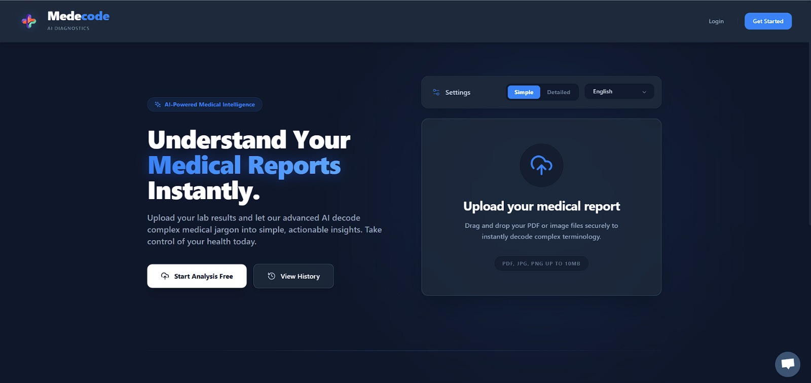
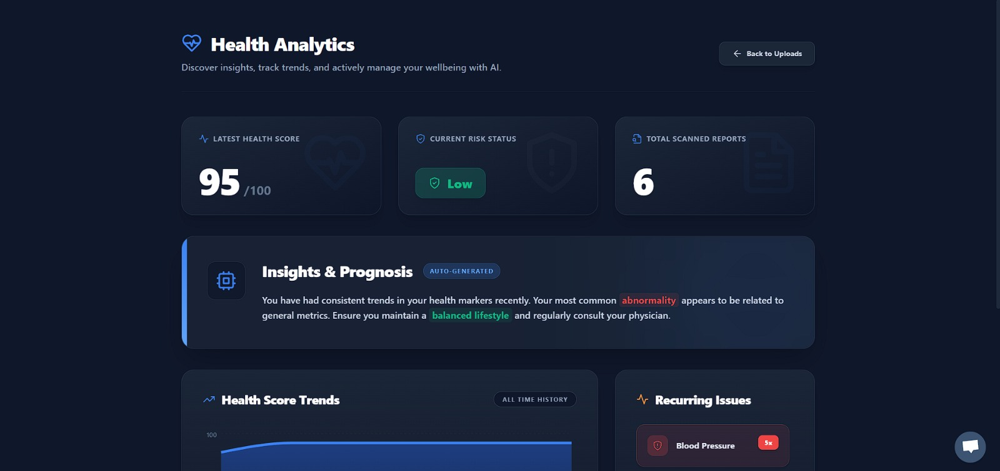
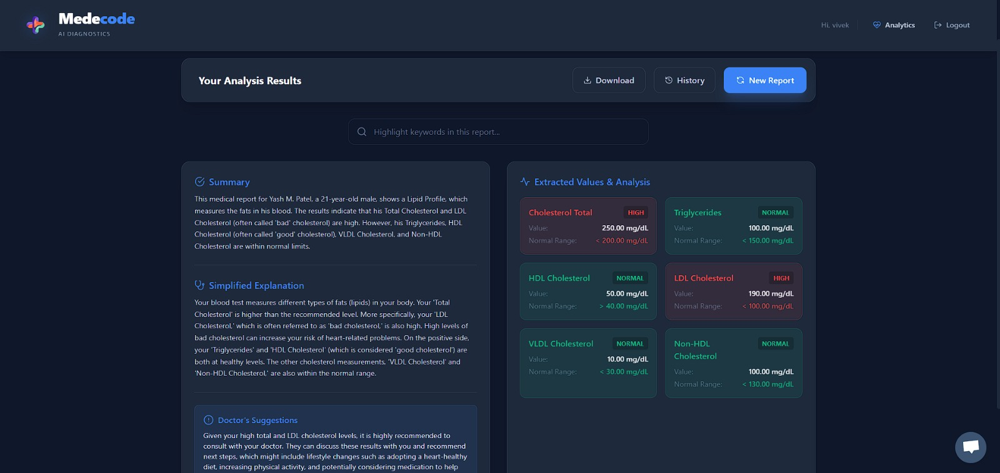
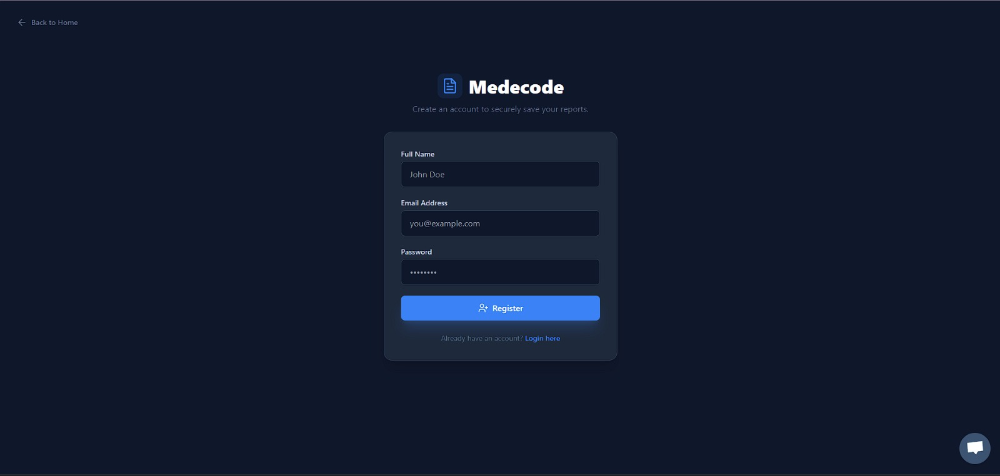

# Medecode – Premium AI Medical Report Analyst

Medecode is a premium, full-stack web application that allows users to upload medical reports (PDF or images), extracts text using Optical Character Recognition (OCR), and uses advanced Generative AI (Google Gemini) to convert complex medical terminology into simple, actionable insights.

## 📸 Platform Previews

| The Premium UI | The Health Analytics Dashboard |
| :---: | :---: |
|  <br> *A highly responsive Split-Hero drag-and-drop landing interface.* |  <br> *Track recurring abnormalities natively with Recharts graphs.* |

| Analysis Results | Secure Authentication |
| :---: | :---: |
|  <br> *Intelligent color-coded text highlighting based on severity.* |  <br> *Clean, centralized authentication component.* |

## ✨ Core Features
- **Intelligent Split-Hero UI:** Upload reports instantly via a dynamic drag-and-drop glassmorphic portal without navigating away.
- **Enterprise-Grade Health Analytics:** A deeply customized Dashboard visualizing your health score trends and recurring abnormalities via Recharts and semantic semantic highlight styling.
- **Strict Format JSON Responses:** Fully structured AI outputs ensuring correct parsing and bulletproof stability.
- **Robust Error Handling & Fallbacks:** Seamless auto-failovers. The app intelligently maps down from `gemini-2.5-flash` to `gemini-1.5-flash` gracefully on rate limits or API fatigue.
- **Advanced Highlighters & Search:** Abnormal, normal, and critical values are explicitly mapped and color-coded natively in your generated reports with a built-in search functionality.
- **Secure Authentication:** JWT-based user session handling integrating distinct user profiles, alongside a rapid-access 'Guest Mode'.
- **Historical Tracking:** Securely maintains a repository of all your past report summaries directly connected to your Mongo schemas.
- **Multi-lingual Native Analysis:** Translate insights seamlessly with one click (English, Hindi, Bengali, Telugu, Marathi, Tamil) directly injected via customized API Prompts.

---

## 🏗️ Tech Stack
- **Frontend:** React (Vite.js), Tailwind CSS (Premium Themes), Recharts (Analytics), Axios, Lucide Icons, react-dropzone.
- **Backend:** Node.js, Express, Multer, JWT, bcryptjs.
- **Database:** MongoDB (Mongoose)
- **AI/OCR Engine:** Google Gemini API (`@google/genai`), Tesseract.js, pdf-parse.

---

## 🚀 Setup Instructions

### Prerequisites
- Node.js (v18+ recommended)
- MongoDB running locally or a MongoDB Atlas URI
- Google Gemini API Key

### 1. Clone & Install Dependencies
First, open your terminal at the project root (`medisimp`):

**Install Backend Dependencies:**
```bash
cd server
npm install
```

**Install Frontend Dependencies:**
```bash
cd client
npm install
```

### 2. Configure Environment Variables
In the `server/` directory, create a `.env` file containing:

```env
PORT=5000
MONGO_URI=mongodb://127.0.0.1:27017/mediexplain
GEMINI_API_KEY=your_actual_gemini_api_key_here
JWT_SECRET=your_secure_jwt_secret_token
```

### 3. Run the Application

**Start the Backend Server:**
Open a terminal and run:
```bash
cd server
npm run dev
```

**Start the Frontend Client:**
Open a new terminal and run:
```bash
cd client
npm run dev
```

Open your browser and navigate to `http://localhost:5173` to view the application!

---

## 🎯 Important Notes
- **Fallback Logic:** If your local MongoDB connection fails, the UI processing will still work by relying on our offline robust dummy-response fallbacks.
- **Format Requirements:** Medical reports should be crisp images (JPG, PNG) or PDFs up to 10MB in size.
- **Performance:** `tesseract.js` requires slight local computational processing. Wait about 3-10 seconds on heavy scans before the AI responds.
